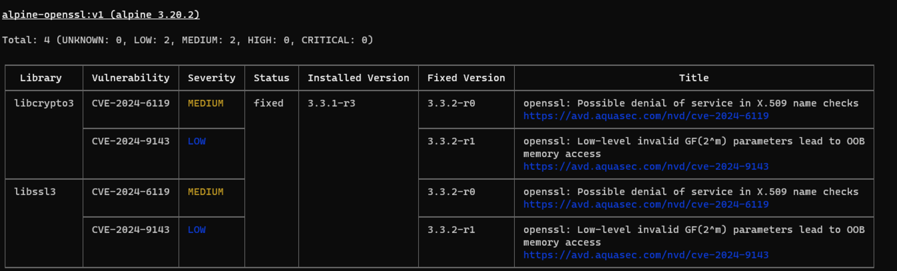

# Hands-On Session: Container Vulnerability Scanning and Mitigation

In this session, you will:
1. Build a Docker image with a specific version of Alpine.
2. Scan the image for vulnerabilities using **Trivy**.
3. Mitigate vulnerabilities by updating the base image or packages.

---

## Step 1: Install trivy
```
sudo apt-get install wget apt-transport-https gnupg lsb-release
wget -qO - https://aquasecurity.github.io/trivy-repo/deb/public.key | sudo apt-key add -
echo deb https://aquasecurity.github.io/trivy-repo/deb $(lsb_release -sc) main | sudo tee -a /etc/apt/sources.list.d/trivy.list
sudo apt-get update
sudo apt-get install -y trivy
```
## Step 2: Prepare the Dockerfile

Create a `Dockerfile` with the following content:

```Dockerfile
# Dockerfile
FROM alpine:3.20.2
```

## Step 3: Build the image

Create a `Dockerfile` with the following content:

```
docker build -t alpine-openssl:v1 .
```

## Step 4: Scan the image for vulnerabilities
```
trivy image alpine-openssl:v1
```



Exercise 1
1. There are 2 medium classified vulnerabilities.
2. Fix the vulnerabilities by editing the Dockerfile, build the image, scan it again, and verify image is clean from vulnerabilities.
3. **Bonus**. Can you suggest another alternative for fixing the image other the one you implemented in step 2?